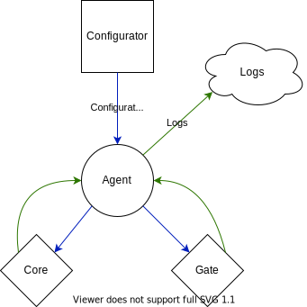

# agent

[](https://github.com/RoboTradeCode/agent/actions/workflows/tests.yml)
[](https://www.python.org/downloads/)
[](https://github.com/python/cpython)
[](https://ru.wikipedia.org/wiki/Linux)
[](https://github.com/psf/black)

Торговый агент. Передаёт конфигурацию для работы гейтов и ядра. Занимается сбором и ретрансляцией логов.

## Установка

### Предварительные требования

Торговый агент использует в своей работе библиотеку [`aeron-python`](https://github.com/RoboTradeCode/aeron-python).
Данная библиотека будет собрана в процессе установки, но для её сборки вам нужен CMake и JDK. Вы можете установить их,
выполнив следующие команды:

```shell
sudo apt install snapd default-jdk -y
sudo snap install cmake --classic
```

### Установка зависимостей

```shell
pipenv install
```

## Использование

```shell
pipenv run python main.py
```

## Принцип работы



### Передача конфигурации

Раз в несколько секунд агент по протоколу HTTP посылает конфигуратору запрос на получение актуальной конфигурации.
Полученная конфигурация в неизменном виде передаётся в канал Aeron, на который должны быть подписаны ядро и связанные с
ним гейты.

Конфигурация также может быть получена по запросу в формате JSON. Сообщение должно включать в себя ключ `action` со
значением `"get_config"`:

```json
{"action": "get_config"}
```

### Ретрансляция логов

Агент в постоянном режиме прослушивает один из каналов Aeron и в неизменном виде пересылает все сообщения из него в
другой канал. Эта функциональность может использоваться для передачи чего-угодно, но предполагается, что это будут логи
связанных сервисов.

## Конфигурация

Для начала своей работы агенту требуется файл-конфигурации `config.toml`. Он будет искать его по относительному пути в
рабочей директории. Пример конфигурации Вы можете посмотреть в файле [`config.toml.example`](config.toml.example).

### Параметры конфигурации

| Параметр                 | Тип          | Описание                                                   |
|--------------------------|--------------|------------------------------------------------------------|
| configurator.url         | String       | URL для подключения к конфигуратору                        |
| update_seconds           | Integer      | Периодичность получения конфигурации в секундах            |
| aeron.subscribers.config | Inline Table | Параметры канала Aeron для приёма запросов на конфигурацию |
| aeron.subscribers.logs   | Inline Table | Параметры канала Aeron для приёма логов                    |
| aeron.publishers.config  | Inline Table | Параметры канала Aeron для публикации конфигурации         |
| aeron.publishers.logs    | Inline Table | Параметры канала Aeron для публикации логов                |

> Параметры каналов Aeron подробнее описаны в репозитории [aeron-python](https://github.com/RoboTradeCode/aeron-python)

### Пример конфигурации сервиса

Агента можно запустить любым способом. Один из них — запуск в качестве сервиса systemd. Если Вы решите использовать его,
то конфигурация может выглядеть следующим образом:

```text
[Unit]
Description=Trade Agent
After=network.target

[Service]
Type=simple
User=ubuntu
WorkingDirectory=/home/ubuntu/agent
ExecStart=pipenv run python main.py
Restart=always
RestartSec=3

[Install]
WantedBy=multi-user.target
```
